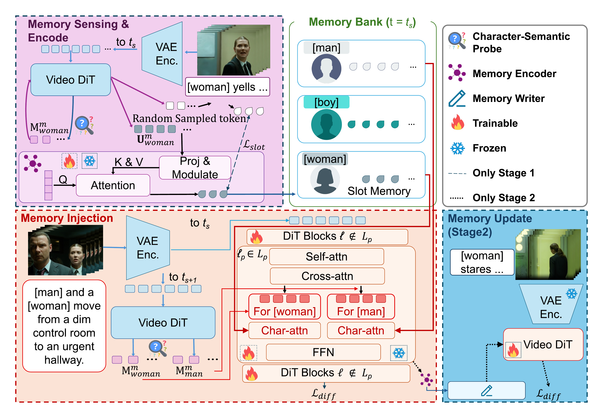

# SlotMem for Wan2.2 I2V

Official code for SlotMem, a two-stage slot-memory pipeline for long video generation with Wan2.2 I2V.

<p align="center">
  
</p>

## Overview

Core launchers:

| Script | Purpose |
|---|---|
| `train_slotmem_stage1.sh` | stage-1 SlotMem training |
| `train_slotmem_stage2.sh` | stage-2 SlotMem training |
| `test_slotmem_stage1.sh` | stage-1 inference |
| `test_slotmem_stage2.sh` | stage-2 inference |

## Setup

```bash
conda create -n slotmem python=3.10 -y
conda activate slotmem

pip install torch==2.7.1 torchvision==0.22.1 torchaudio==2.7.1 --index-url https://download.pytorch.org/whl/cu128
pip install -e .
pip install -r requirements_slotmem.txt
```

Optional packages for data curation and Streamlit interfaces are listed in `requirements_optional.txt`.

## Checkpoints

Download SlotMem checkpoints from Hugging Face:

```bash
huggingface-cli download YilaiLiu-HKU/SlotMem --local-dir . --include "ckpt/*"
```

Set `CKPT_DIR` to your local Wan2.2 I2V base model directory when running training or inference.

## Data

Minimal format examples are included under `sample/`:

```text
sample/
  train/
    candidate_groups.csv
    stage2_candidate_groups.csv
    character_lists/Top001.json
    video/Top001/group_16/*.mp4
  test/3_271/
    frame.jpg
    rewrite_caption.json
```

These files are only for path wiring and format inspection. The training videos in `sample/train/video/` are synthetic placeholders generated to avoid copyright issues.

## Training

```bash
cd /path/to/SlotMem

DATA_ROOT=/path/to/train_data \
CKPT_DIR=/path/to/Wan2.2-I2V-A14B \
bash train_slotmem_stage1.sh

DATA_ROOT=/path/to/train_data \
CKPT_DIR=/path/to/Wan2.2-I2V-A14B \
HIGH_EXPERT_CKPT_PATH=/path/to/stage1_high.pt \
LOW_EXPERT_CKPT_PATH=/path/to/stage1_low.pt \
bash train_slotmem_stage2.sh
```

For the included sample layout:

```bash
CUDA_VISIBLE_DEVICES=0,1 \
CKPT_DIR=/path/to/Wan2.2-I2V-A14B \
DATA_ROOT=./sample/train \
CANDIDATE_CSV=./sample/train/candidate_groups.csv \
CHARACTER_LISTS_DIR=./sample/train/character_lists \
VIDEO_ROOT=./sample/train/video \
OUTPUT_ROOT=./experiments/slotmem_stage1 \
bash train_slotmem_stage1.sh
```

For stage 2, use `CANDIDATE_CSV=./sample/train/stage2_candidate_groups.csv` and provide the stage-1 high/low expert checkpoints.

## Inference

```bash
cd /path/to/SlotMem

CUDA_VISIBLE_DEVICES=0 \
CKPT_DIR=/path/to/Wan2.2-I2V-A14B \
JSON_PATH=./sample/test/3_271/rewrite_caption.json \
REF_IMAGE_PATH=./sample/test/3_271/frame.jpg \
HIGH_EXPERT_CKPT_PATH=/path/to/high_noise.pt \
LOW_EXPERT_CKPT_PATH=/path/to/low_noise.pt \
OUTPUT_ROOT=./inference_outputs/slotmem_i2v \
bash test_slotmem_stage1.sh
```

Use `test_slotmem_stage2.sh` with the corresponding stage-2 checkpoints for the final model.

## Benchmarks

Benchmark helpers operate on already generated SlotMem inference output folders.
Install each external benchmark by following its original GitHub repository. See `bench/README.md` for the expected checkout layout.

```bash
OPENAI_API_KEY=... \
NARRASTREAM_API_BASE_URL=https://api.openai.com/v1 \
bash bench/run_slotmem_benchmarks_api.sh /path/to/inference_output
```

For the full helper, provide the benchmark checkouts and their Python environments explicitly:

```bash
mkdir -p bench
git clone https://github.com/Vchitect/VBench.git bench/VBench
git clone <NarraStream-Bench repository URL> bench/NarraStream-Bench

NARRASTREAM_REPO=./bench/NarraStream-Bench \
VBENCH_PYTHON=/path/to/vbench/python \
NARRASTREAM_API_PYTHON=/path/to/narrastream-api/python \
QWEN35_PYTHON=/path/to/qwen35/python \
OPENAI_COMPAT_API_KEY=... \
OPENAI_COMPAT_BASE_URL=https://api.openai.com/v1 \
bash bench/run_slotmem_benchmarks_gpt41_qwen35.sh /path/to/inference_output
```

ViStoryBench reference images are not auto-collected. Prepare character reference images manually before enabling that benchmark.

## Data Curation

Data curation uses TransNetV2 for shot detection. See `data_curation/README.md` for the required checkout, weights layout, and generated data format.

## License

This release is distributed under Apache-2.0. See `LICENSE` and `NOTICE`.
