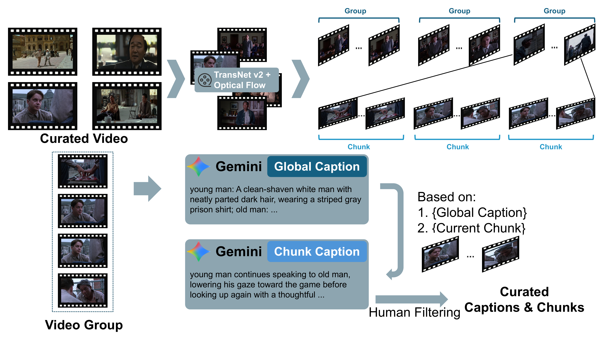

# SlotMem: Character-Addressable Internal Memory for Narrative Long Video Generation

Official code for SlotMem, a character-addressable internal memory framework that stores recurring characters as compact role-wise slots for multi-character narrative long video generation.

<p align="center">
  
</p>

## Visualization

<table>
  <tr>
    <td>
      <video src="https://github.com/user-attachments/assets/73671112-9f29-4e84-88b5-2f9a7cc8c284"
             controls
             muted
             width="100%">
      </video>
    </td>
    <td>
      <video src="https://github.com/user-attachments/assets/1d21a9f9-b9a5-4c31-b1cc-432c7deb533b"
             controls
             muted
             width="100%">
      </video>
    </td>
    <td>
      <video src="https://github.com/user-attachments/assets/283037e1-bc2d-48ea-b6b4-671f5df99dc2"
             controls
             muted
             width="100%">
      </video>
    </td>
  </tr>
</table>

## Overview

Core launchers:

| Script | Purpose |
|---|---|
| [`train_slotmem_stage1.sh`](train_slotmem_stage1.sh) | stage-1 SlotMem training |
| [`train_slotmem_stage2.sh`](train_slotmem_stage2.sh) | stage-2 SlotMem training |
| [`test_slotmem_stage1.sh`](test_slotmem_stage1.sh) | stage-1 inference |
| [`test_slotmem_stage2.sh`](test_slotmem_stage2.sh) | stage-2 inference |

## Setup

```bash
conda create -n slotmem python=3.10 -y
conda activate slotmem

pip install torch==2.7.1 torchvision==0.22.1 torchaudio==2.7.1 --index-url https://download.pytorch.org/whl/cu128
pip install -e .
pip install -r requirements_slotmem.txt
```

Optional packages for data curation and Streamlit interfaces are listed in [`requirements_optional.txt`](requirements_optional.txt).

## Checkpoints

Due to limited training data scaling, we strongly recommend training SlotMem checkpoints on your own target data before running final inference.

Download SlotMem checkpoints from Hugging Face:

```bash
huggingface-cli download YilaiLiu-HKU/SlotMem --local-dir . --include "ckpt/*"
```

Set `CKPT_DIR` to your local Wan2.2 I2V base model directory when running training or inference.

## Data

Minimal format examples are included under `sample/`:

```text
sample/
  train/
    candidate_groups.csv
    stage2_candidate_groups.csv
    character_lists/Top001.json
    video/Top001/group_16/*.mp4
  test/3_271/
    frame.jpg
    rewrite_caption.json
```

These files are only for path wiring and format inspection. The training videos in `sample/train/video/` are synthetic placeholders generated to avoid copyright issues.

## Training

Stage 1:

```bash
cd /path/to/SlotMem

CUDA_VISIBLE_DEVICES=0,1 \
CKPT_DIR=/path/to/Wan2.2-I2V-A14B \
DATA_ROOT=./sample/train \
OUTPUT_ROOT=./experiments/slotmem_stage1 \
bash train_slotmem_stage1.sh
```

Stage 2:

```bash
cd /path/to/SlotMem

CUDA_VISIBLE_DEVICES=0,1 \
CKPT_DIR=/path/to/Wan2.2-I2V-A14B \
LOW_EXPERT_CKPT_PATH=/path/to/stage1_low.pt \
HIGH_EXPERT_CKPT_PATH=/path/to/stage1_high.pt \
DATA_ROOT=./sample/train \
OUTPUT_ROOT=./experiments/slotmem_stage2 \
bash train_slotmem_stage2.sh
```

## Inference

Stage 1:

```bash
cd /path/to/SlotMem

CUDA_VISIBLE_DEVICES=0 \
CKPT_DIR=/path/to/Wan2.2-I2V-A14B \
JSON_PATH=./sample/test/3_271/rewrite_caption.json \
REF_IMAGE_PATH=./sample/test/3_271/frame.jpg \
LOW_EXPERT_CKPT_PATH=/path/to/stage1_low.pt \
HIGH_EXPERT_CKPT_PATH=/path/to/stage1_high.pt \
OUTPUT_ROOT=./inference_outputs/slotmem_stage1 \
bash test_slotmem_stage1.sh
```

Stage 2:

```bash
cd /path/to/SlotMem

CUDA_VISIBLE_DEVICES=0 \
CKPT_DIR=/path/to/Wan2.2-I2V-A14B \
JSON_PATH=./sample/test/3_271/rewrite_caption.json \
REF_IMAGE_PATH=./sample/test/3_271/frame.jpg \
LOW_EXPERT_CKPT_PATH=/path/to/stage1_low.pt,/path/to/stage2_low.pt \
HIGH_EXPERT_CKPT_PATH=/path/to/stage1_high.pt,/path/to/stage2_high.pt \
OUTPUT_ROOT=./inference_outputs/slotmem_stage2 \
bash test_slotmem_stage2.sh
```

## Benchmarks

We provide wrappers for evaluating generated SlotMem videos with [VBench](https://github.com/Vchitect/VBench), [NarraStream-Bench](https://github.com/Eddie0521/NarraStream-Bench), and [ViStoryBench](https://github.com/ViStoryBench/vistorybench). Thanks to these projects for their contributions to the community.

Main quantitative results from the paper, with GPT-4.1 used for VLM-based metrics:

| Benchmark | Metric ↑ | Wan2.2-I2V | +StoryDiff. | +StoryMem | +IAMFlow | +SlotMem |
|---|---|---:|---:|---:|---:|---:|
| VBench | Background Consistency | 0.8580 | **0.8950** | 0.8659 | 0.8929 | 0.8832 |
| VBench | Motion Smoothness | 0.9850 | 0.9805 | 0.9849 | 0.9908 | **0.9912** |
| VBench | Dynamic Degree | 0.7826 | 0.8696 | **0.9130** | 0.3913 | 0.8696 |
| VBench | Aesthetic Quality | 0.5688 | **0.6091** | 0.5260 | 0.5628 | 0.5651 |
| VBench | Imaging Quality | 0.6154 | 0.6620 | 0.5618 | **0.7119** | 0.5963 |
| VBench | Human Anatomy | 0.9381 | 0.9440 | 0.8892 | 0.9062 | **0.9480** |
| ViStoryBench | Style Similarity | 0.7279 | 0.8123 | 0.8040 | 0.8649 | **0.8819** |
| ViStoryBench | Character Similarity | 0.7701 | 0.8098 | 0.7592 | 0.8446 | **0.8603** |
| ViStoryBench | Prompt Alignment | 0.8299 | 0.7627 | 0.8273 | 0.7192 | **0.8733** |
| ViStoryBench | Character Matching | 0.9877 | 0.9879 | 0.9789 | 0.9859 | **0.9957** |
| ViStoryBench | Inception Score | 5.0985 | **6.6777** | 4.7509 | 4.8609 | 6.0769 |
| ViStoryBench | Aesthetic Score | 4.6121 | **5.3475** | 4.3363 | 4.7729 | 4.5278 |
| ViStoryBench | Copy-Paste Complement | 0.4789 | 0.4689 | 0.5004 | 0.4692 | **0.5631** |
| NarraStream-Bench | Subject Consistency | 0.8427 | 0.6927 | 0.7181 | 0.8524 | **0.8771** |
| NarraStream-Bench | Background Consistency | 0.8135 | 0.8146 | 0.8339 | **0.8485** | 0.8444 |
| NarraStream-Bench | Motion Smoothness | 0.3442 | 0.3186 | 0.3360 | 0.4681 | **0.5166** |
| NarraStream-Bench | Temporal Flickering | 0.7523 | 0.6204 | 0.6933 | **0.8614** | 0.8181 |
| NarraStream-Bench | Video Temporal Stability Score | 0.5859 | 0.4133 | 0.6272 | **0.7527** | 0.6836 |
| NarraStream-Bench | Boundary Smoothness | 0.3102 | 0.1778 | 0.5231 | 0.4368 | **0.7529** |
| NarraStream-Bench | Conditional Adjacent | 0.3632 | 0.3264 | 0.4556 | **0.6131** | 0.6126 |
| NarraStream-Bench | Conditional Long-range | 0.7239 | 0.5880 | 0.6165 | 0.7313 | **0.8363** |
| NarraStream-Bench | Dynamic Trajectory | 0.4550 | 0.4935 | 0.5235 | **0.5533** | 0.4723 |
| NarraStream-Bench | Entity Grounding | 0.6633 | 0.5675 | 0.6648 | 0.6029 | **0.6735** |
| NarraStream-Bench | VLM Score | 0.4708 | 0.2817 | 0.4735 | 0.4607 | **0.5384** |

```bash
OPENAI_API_KEY=... \
NARRASTREAM_API_BASE_URL=https://api.openai.com/v1 \
bash bench/run_slotmem_benchmarks_api.sh /path/to/inference_output
```

Detailed benchmark usage, repository checkouts, and environment setup are provided in [`bench/README.md`](bench/README.md).

## Data Curation

<p align="center">
  
</p>

See [`data_curation/README.md`](data_curation/README.md) for the full pipeline and generated data format.

## Citation

If you find SlotMem useful for your research, please cite:

```bibtex
@article{liu2026slotmem,
  title={SlotMem: Character-Addressable Internal Memory for Narrative Long Video Generation},
  author={Liu, Yilai and Zhang, Xin and Zhang, Shiyuan and Du, Hongyang},
  journal={arXiv preprint arXiv:2607.15772},
  year={2026}
}
```

## Acknowledgements

Big thanks to [Wan2.2](https://github.com/Wan-Video/Wan2.2) and [Stable-Video-Infinity](https://github.com/vita-epfl/Stable-Video-Infinity) for their inspiring open-source work.

## License

This release is distributed under Apache-2.0. See [`LICENSE`](LICENSE).
